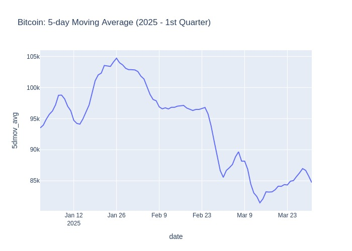

# dataEngineerCodingChallenge
## Nombre del Candidato: Jorge Antonio Matías López
## Challenge

**Objective**:
Develop an automated and scalable process to obtain the 5-day moving
average of Bitcoin’s price during the first quarter of 2022.

**Brief**:
The finance team needs to analyze Bitcoin's behavior to determine if it's feasible
to invest in this cryptocurrency. Your task is to automate this process and be
prepared for real-time adjustments when necessary.

## Descripción
En la primera parte me dediqué a configurar el ambiente para realizar la prueba. Elegí utilizar un notebook de Jupyter dado que es una forma sencilla de visualizar el código y lo dividí con markdown para separarlo en bloques de acuerdo a las tareas solicitadas.

## Despliegue

Para ejecutar este código se tienen los siguientes supuestos

Ambiente 
- java-11-openjdk-amd64
- python 3.10
- Entorno configurado para Spark (SPARK_HOME, JAVA_HOME)
- Jupyter lab o Jupyter Notebook
- pip para la instalación de librerías en Python

Para instalar las librerías en python se anexa el archivo [requirements.txt](requirements.txt)

Pueden ver una vista previa del notebook [aquí](dataEngineerCodingChallenge.ipynb)

## Visualization Bitcoin: 5-day Moving Average
*Nota: Se toma el periodo del año 2025 dado que la versión demo solo permite la consulta de máximo 365 días de historia.*

### Data Analysis 

La ventana de tiempo que se está considerando es el primer trimestre, en los primeros días los datos no aportan mucha información, aunque a partir del día 5 de Enero se puede observar una pequeña tendencia a la alza, con un ligero decremento hacia el día 13 de enero y un máximo el 26 de Enero. 

Posteriormente una tendencia a la baja desde el 26 de Enero hasta el final del trimestre. Es probable que se mantenga la tendencia por lo cual **sería poco conveniente invertir en esta criptomoneda actualmente** ya que se podría tener una depreciación en su valor y generar pérdidas virtuales que tomarían tiempo recuperar. La recomendación es continuar analizando el comportamiento de los precios, con el fin de identificar un momento de menor volatilidad y un bajo costo anticipando una subida de los precios.

## Scalability plan 

Para poder hacer la aplicación escalable,sería necesario realizar un módulo que se encargue de realizar las peticiones hacia la API de acuerdo a parametros específicos como fecha o ventana de tiempo, id de la criptomoneda, y por periodos cortos de tiempo actualizar la información.

Probablemente mediante una UDF se podría realizar la ingesta de datos directamente hacia los worker de pyspark, para paralelizar esta tarea y poder escalar asignando más recursos en la aplicación de spark. 

